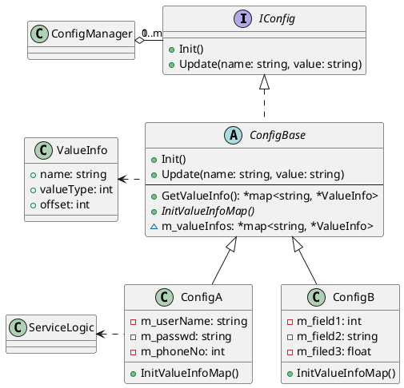

# 前言

Java/Go语言都内置了反射机制，支持在运行期获取类/方法/属性的信息。反射机制有很多的应用场景，如最常见数据的序列化与反序列化，如果没有反射机制，要么是基于代码生成，如protobuf；要么是一行行的手写代码那是纯体力活。

C++并没有内置的一套反射机制，实现反射机制也是C++经常讨论的话题。考虑到C++有强大的元模板编码能力，准确的来说，C++在编译期间是有些自省能力，提供一些is_xxx函数集合以及模板萃取能力，只是不支持动态反射，因为它没有像Java/Go语言拥有运行时环境，且在编译期能力非常孱弱与难用。

C++有不少的开源第三方反射实现库，他们实现方式无外乎二种：

 - 编译时反射：在编译时进行类/属性/方法的遍历 ，且遍历支持用户进行过滤，为类/属性/方法提供静态的附加元信息，并把他们保存起来提供运行时API
 - 运行时反射：提供一套管理框架，在运行时对类/属性/方法信息进行注册管理，使用时再从框架获取对应的信息

前一段时间定位某一C++写的老产品（20年+）的问题，无意中发现代码中有运行时反射的影子，只是代码并没有把这个反射概念进行提炼，代码比较零散。

<!--more-->

# 案例

配置管理在各个系统中是最常用的能力了。案例代码是配置客户端代码，客户端与配置中心进行交互，需要支持如下最基本的功能：

 - 对配置的读取
 - 配置变更刷新

看似很简单的需求，但当产品所有业务级配置项都通过它管理，配置数据大，再加上一些质量属性（实时变更通知，秒级内全量同步）要求就不一样了，还是先看代码吧。为了简化问题的说明，对代码实现做了大量精减（原代码实现太复杂了`:(` ），还原最原始设计思路：



上面类图的设计：

 - 接口IConfig：提供对配置初始化，更新接口
 - ValueInfo：描述每个的配置项的元信息，如名称，类型，其中offset的使用后面再讲，另外类名叫ValueInfo也欠考虑，应该叫ConfigItemMeta可以更好
 - 抽象类ConfigBase：关键方法InitValueInfoMap，初始化所有配置项定义；GetValueInfo返回配置对象所有的配置项集合
 - ConfigManager：负责与配置中心交互，管理所有的IConfig实例，定时从配置中心同步配置项到IConfig实例上（或接收变更事件通在再同步）
 - 配置对象：ConfigA，ConfigB都是具体的配置类定义，它组合一组相近的配置项，它的成员变量为配置项。
 - ServiceLogic：为了简化说明，我把业务逻辑用个通用类ServiceLogic表示，业务逻辑类会聚合具体的配置对象，使用上面的配置项，一个配置对象可以会被多个业务逻辑内使用

我们还是能看出他原始的设计意图：

 - 为了抽象，配置的同步与通知不应该感知到具象的ConfigA，ConfigB的成员变量名称，否则需要把IConfig向下转型为具体的ConfigA，一个个配置项赋值，这样的缺点一是导致双向依赖，二是代码不通用，纯体力活，维护也麻烦。GetValueInfo方法起了关键作用，可以获得到配置项定义
 - 为了性能，业务逻辑看到的是具象的ConfigA，ConfigB，可以直接cfgAtr->m_userName来获取配置项值，而不是在一个通用的配置表上通过配置ID来查询配置值，这样的缺点一是涉及到查找，二是涉及到类型转换

那问题是怎么通过拿到配置定义就可以把配置值更新到对应的成员变量上？实际情况还会有多线程并发的问题，先假设业务逻辑处理与配置更新同一时刻只会有一个线程在处理。如果是Java语言，通过反射就很可以方便地更新值了。C++怎么搞？原作者利用了C++对象的内存布局的特性，在每个类的InitValueInfoMap方法的实现上可以看到：

```c++
void ConfigA::InitValueInfoMap() 
{
    // 按源码实现的伪码，代码可以优化，封装为函数，一个成员变量的注册只需要调用一个函数
    ValueInfo valueInfo1 = new ValueInfo;
    valueInfo1->name = "UserName";
    valueInfo1->valueType = ValueType.String;
    valueInfo1->offset = (char*)&m_userName - (char*)static_cast<IConfig*>(this); // 有告警，请先忽略
    (*m_valueInfos)[valueInfo1.name]= valueInfo1;

    // 省略其它的成员变量加入m_valueInfos
}
```

ValueInfo.offset是记录每个配置项（成员变量）到IConfig指针的偏移量：

```c++
ConfigBase::Update(string name, string value) 
{
    // 伪代码
    ValueInfo value = *(GetValueInfo()->find(name));
    this->*((char*)static_cast<IConfig*>(this) + value->offset) = value; // 若是其它类型，而得转换类型
}
```

至此我们大概弄清楚了，其实这是就是动态反射，先注册，再根据注册信息对成员变量地址来赋值。当ConfigManager收到配置变更时，在基类中通过变量的偏移量来计算子类的成员变量地址，再进行赋值。

那另一个疑问是为什么不是直接记录成员地址指针，而不是记录偏移量？应该还是为了性能，ConfigA类可以有多个对象实例，而无论多少个实例，根据内存布局可知成员变量的偏移量是不会变的。实际代码中ConfigBase::m_valueInfos的定义了虽是类的成员变量（而非static），它却指向ConfigBase.cpp中的一个静态全局变量，应该最早设计记录成员地址指针，后面性能优化是记录偏移量。并且还在代码中注意说明InitValueInfoMap方法只需要一次调用，性能从X秒降到XX毫秒。


# 扩展阅读

## 偏移量

假定有一个结构体`Point { int x; int y; }`，获取成员变量的偏移量方法：

 - 方法一：

```c++
int Point::* offsetX = &Point::x;
int Point::* offsetY = &Point::y;

int offSetX_ = reinterpret_cast<int>(*(void**)(&offsetX));
int offSetY_ = reinterpret_cast<int>(*(void**)(&offsetY));
```

 - 方法二：
```c++
// 即 ((int)&((structure*)0)->member);
int offSetX = reinterpret_cast<int>(&(reinterpret_cast<Point*>(0))->x); 
int offSetX = reinterpret_cast<int>(&(reinterpret_cast<Point*>(0))->y);
```

当类存在继承，存在虑函数或者存在虚拟继承时，方法二会带来问题，计算来自虚基类成员偏移量时，对空对象成员取指针的操作会失败。想进一步了解C++对象的内存布局的，建议去看《深度探索C++对象模型》。尤其当涉及虑函数，虑继承，多重继承组合时太复杂了。回到上面的案例，计算相对基类(接口)偏移量难以理解，也带来风险。


## 运行时

运行时反射的一些开源实现，实现原理也差不多，主要是看它实现的完备程度：

 - [rttr](https://github.com/rttrorg/rttr)
 - [meta](https://github.com/skypjack/meta)
 - [UDRefl](https://github.com/Ubpa/UDRefl) 
 - [ponder](https://github.com/billyquith/ponder)

我们先看第一个开源，使用样例如下。看到代码是不是感觉跟案例的代码思路类型，只是案例把属性的管理揉在配置类的代码中，没有提取一个简单的类属性管理框架

```c++
#include <rttr/registration>
using namespace rttr;

struct MyStruct { MyStruct() {}; void func(double) {}; int data; };

RTTR_REGISTRATION
{
    registration::class_<MyStruct>("MyStruct")
         .constructor<>()
         .property("data", &MyStruct::data)
         .method("func", &MyStruct::func);
}
```

## 编译时

从C++11开始新增一些Attribute，它们用来给编译器提供一些额外的信息，来产生一些优化或特定的代码，也可以给其它开发者一些提示信息。例如：

```c++
[[carries_dependency]] C++11, 让编译期跳过不必要的内存栅栏指令
[[noreturn]] C++11, 函数不会返回
[[deprecated]] C++11, 函数将弃用的警告
[[fallthrough]] C++17, 用在switch中提示可以直接落下去，不需要break
[[nodiscard]] C++17, 表示修饰的内容不能被忽略，可用于修饰函数，标明返回值一定要被处理
[[maybe_unused]] C++17, 提示编译器修饰的内容可能暂时没有使用，避免产生警告
```

遗憾的是，这些只是给编译器使用的，C++没有运行期环境，也就不能像Java的Annotion与Go的Tag，可以在运行期对他们使用。不过给我们带来的启示是，也可以定义一些方法或成员变量的Attribute，让编译器来生成相应元数据信息的代码，可以在运行期使用。

自定义的Attribute需要基于编译器对它进行解释，搜索了一下，Github还真有对C++ AST解释封装库[cppast](https://github.com/foonathan/cppast)，并且可以配合Clang来使用。

关于静态反射也有人向C++标准组织在2014年提案过[Static reflection](https://open-std.org/jtc1/sc22/wg21/docs/papers/2014/n3996.pdf) ，初步翻了一下文档，在第4章定义了技术规范有：

 - 元数据对象的概念类型
 - 概念转换C++具体代码
 - 反射函数与操作符

提案者还基于C++11实现一个[Mirror框架](http://kifri.fri.uniza.sk/~chochlik/mirror-lib/html/)，感兴趣的可以看看。


# 结语

本文通过对配置管理原始设计进行还原，理解了作者的设计意图，其中利用C++成员变量的偏移量，来方便对配置项统一更新操作。从它引申联想到了C++的反射机制，走马观花地看一下运行时与编译时反射。如果你正想搞一个反射框架，打开天窗，可以博采众长。 